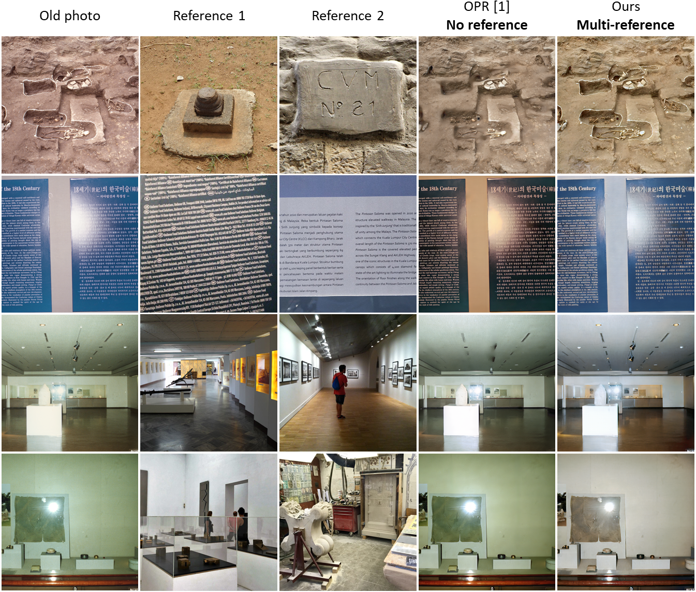
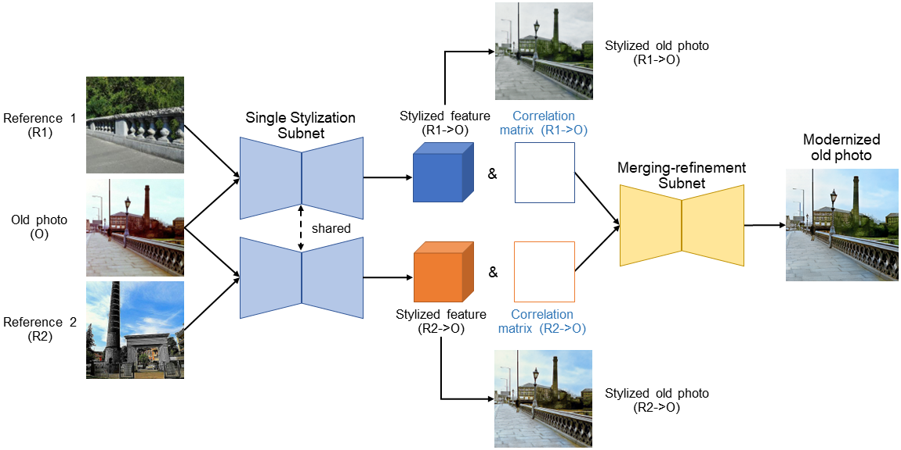
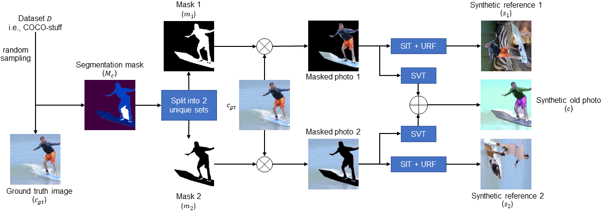

# Modernizing Old Photos Using Multiple References via Photorealistic Style Transfer

We present a Multi-Reference-based Old Photo Modernization (**MROPM**) framework that can modernize old photos using multiple references by performing stylization and enhancement in a unified manner. MROPM initially stylizes old photos using multiple references through photorealistic style transfer. Then, it further enhances the results to produce modern-looking images. Compared to the previous state-of-the-art (SOTA), the proposed method can perform modernization on real old photos even without using old photos during training. It depends on the selection of references, which need to have similar semantics to the old photo.

<p align="center">  </p>

> [**Modernizing Old Photos Using Multiple References via Photorealistic Style Transfer**](https://kaist-viclab.github.io/old-photo-modernization/)     
> [Agus Gunawan](https://agusgun.github.io/), [Soo Ye Kim](https://sites.google.com/view/sooyekim), [Hyeonjun Sim](https://sites.google.com/view/hjsim), [Jae-Ho Lee](https://scholar.google.com/citations?user=FW4BUN0AAAAJ&hl=ko), [Munchurl Kim](https://www.viclab.kaist.ac.kr/)        
> CVPR 2023

[[`project page`](https://kaist-viclab.github.io/old-photo-modernization/)] [[`arxiv`](https://arxiv.org/abs/2304.04461)] [[`PDF`](https://arxiv.org/pdf/2304.04461)] [[`bibtext`](#citation)]

## Important Note
Please run all of the following instruction inside `code` directory.


## Updates
* 03/21/2024 - Final code for training and evaluation are published.

## Installation

### Clone Only The Code Directory
This repository contains website that is big (~1.5 GB) due to the demo.
One can just clone the `code` directory to clone only the code part.

### Environment Setup
```
cd code
conda create -n old-photo-modernization python=3.10
conda activate old-photo-modernization

pip install -r requirements.txt
```

### Download Pretrained Model and Run Modernization Inference on Samples Data
1. Download the pretrained model from: [[HuggingFace](https://huggingface.co/agusgun/old-photo-modernization)]
2. Place the models in the following way
```
- multi_reference_modernization_paper/checkpoint_latest.pt -> code/resources/experiments/multi_reference_modernization_paper/checkpoint/checkpoint_latest.pt
- multi_reference_modernization_paper_retrain_stage2/checkpoint_latest.pt -> code/resources/experiments/multi_reference_modernization_paper_retrain_stage2/checkpoint/checkpoint_latest.pt
- stylization/latest_netE.pth -> code/resources/pretrained_model/stylization/paper/checkpoint/latest_netE.pth
- stylization/latest_netD.pth -> code/resources/pretrained_model/stylization/paper/checkpoint/latest_netD.pth
```
3. Run sample inference with the following command:
```
python main.py --config resources/experiment_config/multi_reference_modernization/paper_test_final.yaml
```


## Method Overview
Our method consists of two key ideas: 1) unified network that can perform stylization using multiple references and enhancement and 2) a synthetic data generation scheme to train the netwokr in self-supervised manner.
<p align="center">
    
</p>
<p align="center">
    
</p>

## MROPM Inference Demos
One can easily run our inference code after [installation](#installation) by using a simple command:
```
python main.py --config resources/experiment_config/multi_reference_modernization/paper_test_final.yaml
```
In the config file, some important variables are:
- `datasets.eval.dataset.params.root_dir`: This is the location of your data
All of the images including input and references need to be in the same resolution.
In the data directory one needs to create `content` and `style` directories.
You can see that `style` directory contain sub-directories that have the same name as the name of the file inside content. Each sub-directory contains the reference images. 

The results will be available under:
```
resources/experiments/multi_reference_modernization_paper/outputs
```

## MROP Training Instruction

### Important Note
There is a discrepancy between the training code and the training details in the paper, such as:
- we remove the learning decay scheduler
- we train for longer epoch
Unfortunately, longer epoch does not guarantee better results. You can see the results by using our train model that we provide in the [[HuggingFace](https://huggingface.co/agusgun/old-photo-modernization)].


1. Download COCO 2017 training images and its `stuff` annotations:
```
- [Training images](http://images.cocodataset.org/zips/train2017.zip)
- [Stuff annotations](http://images.cocodataset.org/annotations/stuff_annotations_trainval2017.zip)
```

2. Place the training images and stuff annotations inside:
```
resources/dataset/modernization/COCO
```

The directory tree inside `resources/dataset/modernization/COCO` will look like this:
```
.
├── annotations2017
│   ├── train2017
│   └── val2017
└── train2017
```

3. Run stage 1 training with the following command:
```
python main.py --config resources/experiment_config/multi_reference_modernization/paper_train_final_stage1.yaml
```
Some important configs here are:
- `engine.gpu_id`: id of the gpu that you want to use
- `model.params.st_backbone.encoder_path`: the path of stylization backbone's encoder
- `model.params.st_backbone.decoder_path`: the path of stylization backbone's decoder
- `datasets.train.dataset.params.root_dir`: the path of the training images
- `datasets.train.dataset.params.annotation_dir`: the path of the annotation images
- `datasets.eval.dataset.params.root_dir`: the path of the evaluation images during training
- `datasets.eval.dataset.params.annotation_dir`: the path of evaluation annotations during training


4. Run stage 2 training after the stage 1 training finished with the following command:
```
python main.py --config resources/experiment_config/multi_reference_modernization/paper_train_final_stage2.yaml
```
Some important configs here are:
- The same as in step 3
- `model.training.multistage.pretrained_path`: the path of pretrained model from stage 1


## License and Acknowledgement
The majority of MROP is licensed under the [Apache License](LICENSE). However, some portions of the project are available under separate license terms that are inside the code with the source and [Contrastive Unpaired Translation](https://github.com/taesungp/contrastive-unpaired-translation) project.

## Support
If you have any general questions, feel free to email us at [Agus Gunawan](mailto:agusgun@kaist.ac.kr). If you have code or implementation-related questions, feel free to send emails to us or open an issue in this codebase. We recommend to open an issue in this codebase to help other.

## Citation
If you find our work inspiring or use our codebase in your research, please consider giving a star ⭐ and a citation.

```
@inproceedings{gunawan2023modernizing,
  title={Modernizing Old Photos Using Multiple References via Photorealistic Style Transfer},
  author={Gunawan, Agus and Kim, Soo Ye and Sim, Hyeonjun and Lee, Jae-Ho and Kim, Munchurl},
  booktitle={Proceedings of the IEEE/CVF Conference on Computer Vision and Pattern Recognition},
  pages={12460--12469},
  year={2023}
}
```